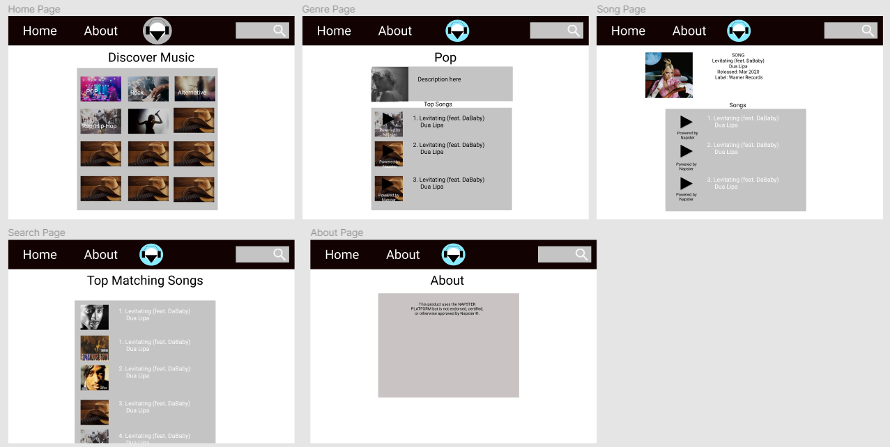

# Harbinger Musik

## Deployment Link

<a href="https://team-harbinger.github.io/Harbinger-Musik/" target="_blank">https://team-harbinger.github.io/Harbinger-Musik/</a>

## Table of Contents
1. [Overview](#Overview)
1. [Product Spec](#Product-Spec)
1. [Wireframe](#Wireframe)

## Overview
### Description
Music streaming platform that uses Napster's API. Find and play song previews from popular music artists. Also, categorizes genres and albums.

### App Evaluation
- **Category:** Music
- **Mobile:** This website would be primarily developed for desktop but would perhaps be just as viable on a mobile device. Functionality be similar for desktop and mobile devices if mobile is developed.
- **Story:** Music streaming platform that uses Napster's API. Find and play song previews from popular music artists. Also, categorizes genres and albums.
- **Market:** Individuals who want to find and listen to music, curious about popular or trending releases.
- **Habit:** This app could be used as often as the user wanted.
- **Scope:** Host the web app on GitHub Pages. If we continue to work on the app, we would add more social features like having a friends list, chatrooms, etc. We would also add other themes.

## Product Spec
### 1. User Stories (Required and Optional)

**Required Must-have Stories**

- [X] User browses the latest top songs, albums, artists, and genres.
- [X] Plays song previews
- [X] User queries songs, albums, or artists with the search bar.
- [ ] User picks what their favorite artist/genre/etc.

**Optional Nice-to-have Stories**
- [ ] Shows the stack navigator (Ex: Home / Pop / )
- [ ] Show more song lists on each page.
    #### Premium users ONLY:
- [ ] Profile pages for each user
- [ ] Settings (Accesibility, Notification, General, etc.)
- [ ] Shuffle Button (i.e. random encounter/random song)
- [ ] Premium users ONLY: Queue songs to play
- [ ] Chatroom
- [ ] Friends list
- [ ] Save songs in playlist

### 2. Page Archetypes
#### Required
* Music Discovery Page - User looks through music genres.
* Genre Selected Page - User selected a genre and can now view songs of the selected genre. Genre description is also shown.
* Song Selected Page - Displays album that the selected song is in with other song previews with the album. 
    * Artist name, release date, label, and album/song cover.
* Search Result Page - Shows results of user query.

#### Optional
* Login Page
* Register Page - User signs up for a new account
* Profile Page - Allows user to upload a photo.
* Settings Page
   * Lets people change language, and app notification settings.

### 3. Navigation

**Navigation Bar** (Navbar to Page)

* Discover
* About
* Search Bar

Optional:
* Profile
* Settings
* Library
* Friends List
* Chatroom

**Flow Navigation** (Page to Page)
* Discover -> Genre Selection -> Song Selection
* Discover -> Search Result -> Song Selection

Optional:
* Log-in -> Account creation if no log in is available
* Music Selection (Or Queue if Optional) -> Jumps to Chat
* Profile -> Text field to be modified. Upload profile picture
* Settings -> Toggle settings

## Wireframe
 
